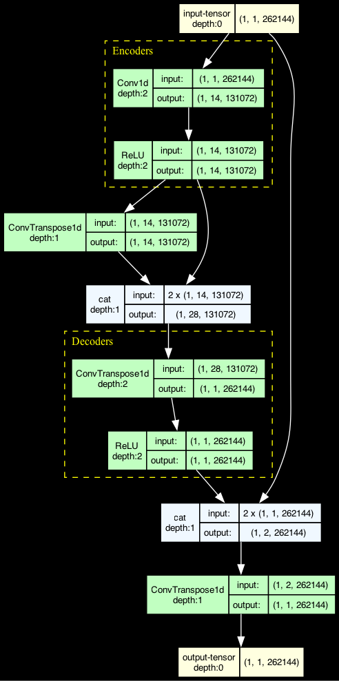
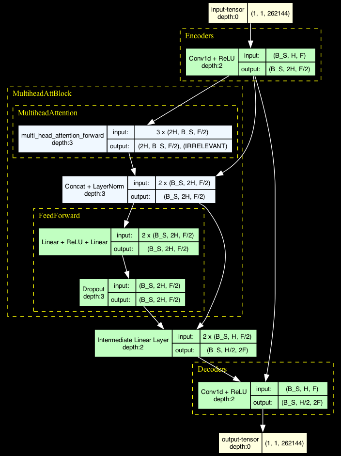
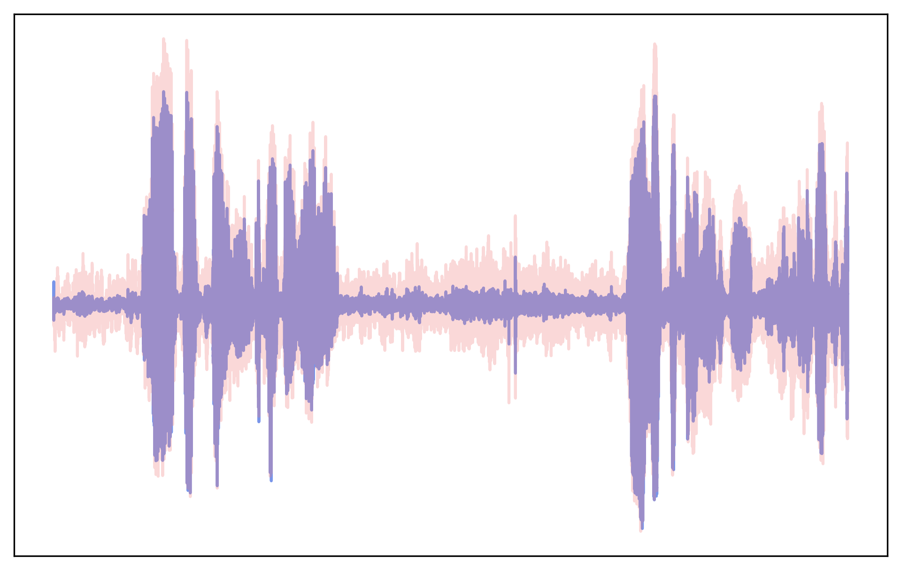
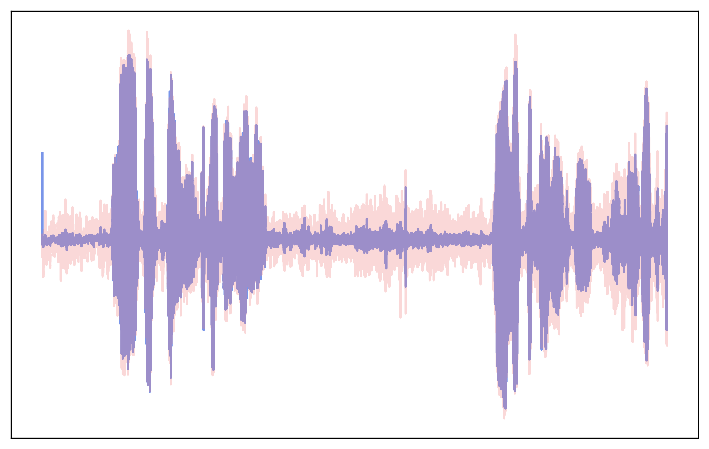
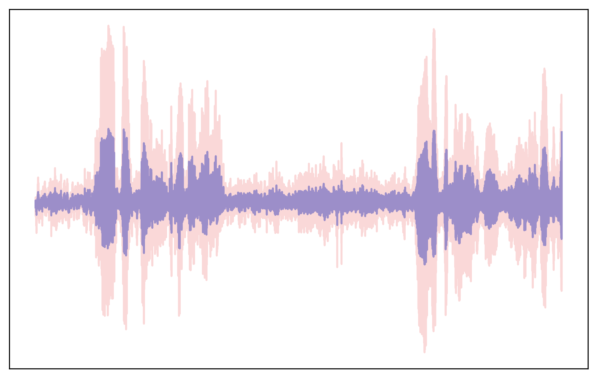

# Cicadence: Deep Learning Based Noise Suppression

## Table of Contents
- [Setup/Installation](#setupinstallation)
  - [Code-Related Setup](#code-related-setup)
  - [Data-Related Setup](#data-related-setup)
- [Notebooks Overview](#notebooks-overview)
  - [Training Notebooks](#training-notebooks)
  - [Evaluation Notebooks](#evaluation-notebooks)
- [Dataset Python Files](#dataset-python-files)
- [Architecture Python Files](#architecture-python-files)
  - [Cicadence UNet](#cicadence-unet)
  - [Cicadence Attention UNet](#cicadence-attention-unet)
  - [Nvidia CleanUNet](#nvidia-cleanunet)
- [Results](#results)
- [Works Cited](#works-cited)

## Setup/Installation
### Code-Related Setup
1. In terminal do `cd` to the installation location
1. Clone the Repository -->  `git clone https://github.com/alex-grindrod/cicadence.git`
1. Setup and Activate Python Virtual Environment
    1. `python -m venv cicadenv`
    1. `source cicadenv/bin/activate`
1. Install Python packages --> `python install -r requirements.txt`
1. Jupyter Notebook + Kernel Setup
    1. `pip install jupyter ipykernel`
    1. `python -m ipykernel install --user --name=venv --display-name "Cicadenv"`

### Data-Related Setup
1. Download Dataset: [CSTR VCTK Corpus](https://datashare.ed.ac.uk/handle/10283/2791)
    1. If you need to save memory, the only relevant files are:
        - `clean_trainset_28spk_wav.zip`
        - `noisy_trainset_28spk_wav.zip`
    1. Extract `clean_trainset_28spk_wav.zip` in `data/raw/28spk`
    1. Extract `noisy_trainset_28spk_wav.zip` in `data/raw/28spk`
    1. If you want to include the other data, you may need to modify the `src/data/waveform_data.py`
1. Prepare Data `.pt` files
    1. IMPORTANT: Ensure you have > 20 GB of available memory before running
    1. Sidenote: If you run into memory issues/errors, you need to delete the generated `.pt` files before running the script again
    1. `python3 src/data/waveform_data.py`
    1. When finished two `.pt` files should be in `data/processed/28spk`

## Notebooks Overview
1. Training Notebooks - one for each model architecture in `src/models/waveform`. Each can also conduct hyperparameter optimization (set `HYPER_OPT` to `True`), and the ckpt saving strategy can be modified in `train()`
    1. `train_unet.ipynb` --> UNet Trainer
    1. `train_unet_att.ipynb` --> Attention UNet Trainer
    1. `train_unet_clean.ipynb` --> Nvidia CleanUNet Trainer

1. Evaluation Notebooks
    1. `formal_eval.ipynb` --> reports model's PESQ score and Average SNR on test dataset
    1. `data_graph.ipynb` --> Graphs the avg SNR, training loss, and validation loss
    1. `demo_models.ipynb` --> Performs inference on an audio sample, shows resulting waveform and plays model-processed audio

## Dataset Python Files
1. `src/data/waveform_data.py` --> processes .wav files
    - Concatenates clean waves into 1 tensor | noisy waves into 1 tensor
    - Splits tensor every 262144 audio samples ~ 5 seconds --> clean and noisy sample
    - Prepares sampled split in `WaveformDataset` class

## Architecture Python Files
### Cicadence UNet
 -  `src/models/waveform/cicada_unet.py` --> UNet architecture in PyTorch

### Cicadence Attention UNet
 -  `src/models/waveform/cicada_unet_att.py` --> UNet architecture with attention bottleneck

### Nvidia CleanUNet
 -  `src/models/waveform/cicada_clean_unet_att.py` --> Nvidia CleanUNet architecture 

## Results

Evaluation was done on the test subset of the 28spk dataset
|           | Cicadence UNet | Cicadence Attention UNet | Nvidia CleanUNet |
|-----------|----------------|--------------------------|------------------|
| PESQ      | 1.198          | 1.268                    | 1.394            |
| SNR (dB)  | 9.633          | 11.532                   | 3.692            |
| Size (MB) | 2.4            | 474.9                    | 132.9            |

Visualization of each model's effects on the same waveform samples

| Best Models              | Waveform (Red = Noise \| Blue = Cleaned) |
|--------------------------|------------------------------------------|
| Cicadence UNet           ||
| Cicadence Attention UNet ||
| Nvidia CleanUNet         ||

## Works Cited

**Dataset**  

 - Cassia Valentini-Botinhao. Noisy speech database for training speech enhancement algorithms and
tts models, 2016 [sound], 2017. URL https://doi.org/10.7488/ds/2117.

**Related Architectures Works**

 - Zhifeng Kong, Wei Ping, Ambrish Dantrey, and Bryan Catanzaro. Speech denoising in the waveform
domain with self-attention. In ICASSP, 2022.
 - Darshan Deshpande. "Noise Suppression Using Deep Learning." Medium, 
Sep 13, 2020. URL https://medium.com/analytics-vidhya/noise-suppression-using-deep-learning-6ead8c8a1839.
